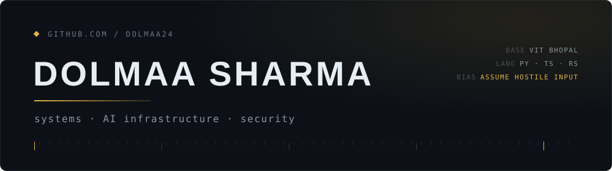
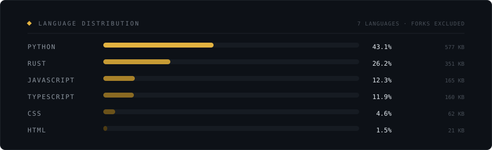
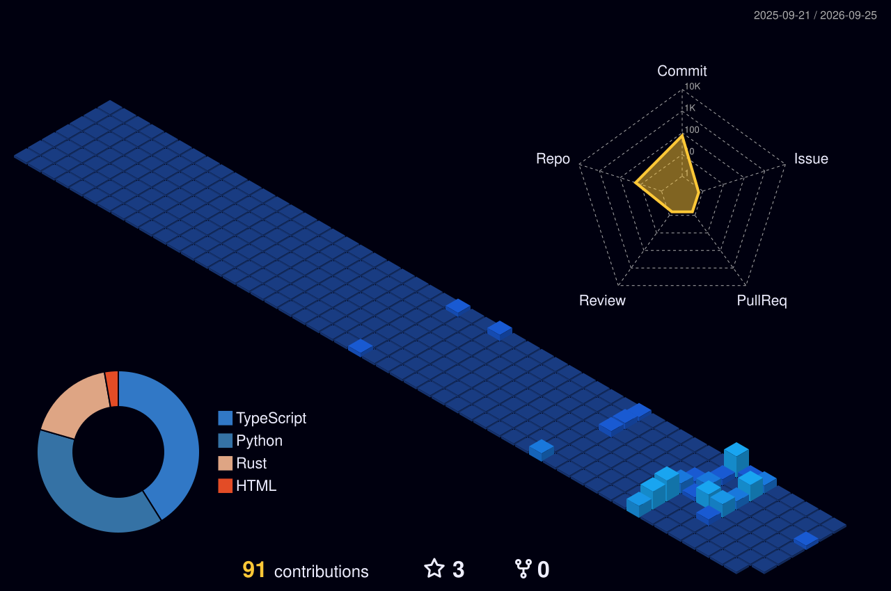
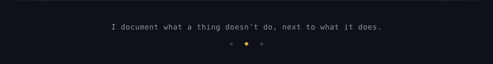

  

&nbsp;

I build infrastructure for systems that can't assume good input — a shell gate in Rust that decides whether an AI agent's command is allowed to run, signed telemetry for remote exams where the client is presumed compromised, retrieval pipelines assembled from parts rather than borrowed from a framework.

Mostly Python and TypeScript, increasingly Rust. CS at VIT Bhopal. I'd rather write the measurement than the adjective, and I document what a thing *doesn't* do next to what it does.

## Selected work

<b>shellguard</b> &nbsp;·&nbsp; a command gate for AI agents &nbsp;·&nbsp; <code>Rust</code>

 

Decides whether an agent's shell command should run, then confines whatever it lets through.

Every rule keys on **program identity**, not on the string you typed — so `find . -name "*.log" -exec rm -rf /etc {} \;` is judged as an `rm`, despite containing no `rm` in argv position. It unwraps `sudo`, `env -i`, `xargs`, `timeout`, `nice`, `bash -c`, ANSI-C quoting (`$'\x72\x6d'`), and commands hidden inside default-value expansions and redirect targets.

| | full gate | parse only |
|---|---|---|
| p50 | 2.8 µs | 542 ns |
| p99 | 13.4 µs | 1.5 µs |
| max | 35.7 µs | 21.9 µs |

58 000 samples over a 145-command corpus, M2 MacBook Air, release build.

Verdicts combine by severity rather than declaration order — `Allow < Confine < Ask < Deny` — so no broad allow can outrank a narrow deny. An unmatched command defaults to **`Confine`, not `Allow`**: "no rule matched" means the ruleset had nothing to say, which for agent-authored input is the common case rather than evidence of safety.

Two layers, because one isn't enough: a userspace gate that produces a reason a human can act on, and a kernel sandbox — Seatbelt on macOS, Landlock + seccomp-BPF on Linux — that contains what the gate permits. The gate is *not* a security boundary and the design docs say so; static analysis of shell is undecidable and `eval "$(curl x)"` is a one-line proof.

`Rust` `seccomp-BPF` `Landlock` `Seatbelt` `static analysis`

**[→ source](https://github.com/Dolmaa24/AgentShield-Micro-Runtime)**

<b>Proctoring AI</b> &nbsp;·&nbsp; edge-to-cloud exam integrity &nbsp;·&nbsp; <code>Python</code> <code>TypeScript</code>

 

Computer vision runs on the candidate's machine in real time; the backend holds policy, state, identity and evidence. **Raw video never touches the telemetry path.**

The client is treated as hostile by construction: per-session key derivation, HMAC-signed events, and a simulator that ships six scripted client-tampering modes so the integrity checks are tested against the attack rather than assumed. Policy lives in 16 declarative rules, separated from the fusion layer that does temporal filtering with no I/O of its own. The proctor console **fails closed** — there is no unauthenticated mode, because those endpoints carry every candidate's flags.

Nine components, run end-to-end: camera → MediaPipe → IPC → signed WebSocket → gateway → fusion → proctor console.

`FastAPI` `MediaPipe` `Electron` `LiveKit` `SQLite` `HMAC` `pytest`

**[→ source](https://github.com/Dolmaa24/Proctoring-AI)**

<b>XG_Backend</b> &nbsp;·&nbsp; AI recruitment pipeline &nbsp;·&nbsp; <code>Python</code>

 

An async REST API that runs the whole hiring loop: multi-modal resume parsing (PyMuPDF + Tesseract OCR, so scanned PDFs work), dense-vector semantic matching against job posts instead of keyword ATS filtering, and rubric-based LLM interviews with deterministic weighted ranking.

Non-blocking FastAPI I/O, Celery for the heavy ML, PostgreSQL for ACID state, Alembic migrations, Dockerised. Rate limiting, path-traversal guards and prompt-injection defence are treated as backend requirements rather than features.

`FastAPI` `PostgreSQL` `Celery` `Docker` `sentence-transformers` `Alembic`

**[→ source](https://github.com/Dolmaa24/XG_Backend)**

<b>Modular RAG Pipeline</b> &nbsp;·&nbsp; retrieval built from parts &nbsp;·&nbsp; <code>Python</code>

 

Ingestion → chunking → embedding → vector store → retrieval → generation, each stage decoupled and swappable. Built from scratch rather than on a framework, specifically so the mechanics stay visible.

Local `all-MiniLM-L6-v2` embeddings (384-dimensional, no paid API in the loop), ChromaDB persisted to disk and tuned for cosine similarity, Groq for inference, and prompt templates that keep answers strictly grounded in retrieved context. Parses encrypted PDFs via pycryptodome.

`Python` `ChromaDB` `HuggingFace` `Groq` `MIT`

**[→ source](https://github.com/Dolmaa24/RAG)**

<b>AuraAI</b> &nbsp;·&nbsp; encrypted chat on $0 of infrastructure &nbsp;·&nbsp; <code>JavaScript</code>

 

AES-256-GCM encryption and HMAC-SHA-512 signing run entirely in the browser through the Web Crypto API — no external crypto libraries, and plaintext never leaves the device. PBKDF2 at 100 000 iterations derives the session keys; a fresh 96-bit IV per message.

Ships a **crypto inspector**: open any message you sent and read its IV, HMAC, ciphertext and fingerprint. Streaming multi-model inference (Llama 3.3 70B, Mixtral, Gemma), vision input, file context, voice I/O — with the API key held server-side and 200 req/15 min rate limiting. Vercel + Render, total infrastructure cost $0.

`Web Crypto API` `AES-256-GCM` `PBKDF2` `Groq` `Vercel` `Render`

**[→ live](https://chatbot-theta-two-23.vercel.app)** &nbsp;·&nbsp; **[→ source](https://github.com/Dolmaa24/CHATBOT)**

<b>Finget</b> &nbsp;·&nbsp; decision-first personal finance &nbsp;·&nbsp; <code>TypeScript</code>

 

Most expense trackers tell you what you spent last month. Finget computes a **Safe Daily Allowance** — what you can spend today without breaking the budget — by subtracting obligations, savings goals and month-to-date spend from income in real time.

An SSE-streamed AI coach with a persistent conversation-memory model and live injection of your actual financial context. A what-if simulator that prices a purchase in *days of delay* against a savings goal. And "Friends Mode" shared wallets routed through explicit `?context=` parameters rather than implicit global state — so scope is always legible in the request.

`React` `TypeScript` `Vite` `Tailwind` `SSE` `Node.js`

**[→ source](https://github.com/Dolmaa24/Finget)**

## Stack

| | |
|---|---|
| **languages** | Python · TypeScript · Rust · JavaScript · SQL |
| **backend** | FastAPI · async SQLAlchemy · Celery · PostgreSQL · SQLite · Docker · Alembic |
| **AI systems** | RAG from first principles · sentence-transformers · ChromaDB · HuggingFace · Groq · MediaPipe |
| **security** | AES-256-GCM · HMAC · PBKDF2 · seccomp-BPF · Landlock · Seatbelt · threat modelling |
| **frontend** | React · TypeScript · Vite · Tailwind · Electron |

## Signals

  

<!--
  Optional — a 3D contribution skyline. The workflow that generates it is already
  committed at .github/workflows/3d-contrib.yml; run it once from the Actions tab,
  then delete these two comment lines to switch the image on.

  

  
  

-->

## Reach me

Open to internships and collaboration on systems, AI infrastructure and security tooling.

 

&nbsp;

  

